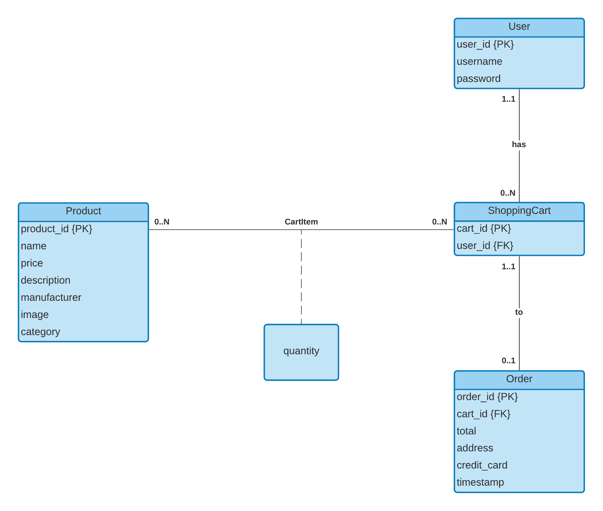

# SEC-Practical-Assignment
Practical Assignment code for the SEC Project. This has been implemented and done by Jeremy Ng Kwik Tung, Steven Harja, Wilbert Ongosari and Aman Khan. The application is a simple shopping website written using PHP, HTML and CSS.

* Test Account Login Details: Username = test; Password = test

PHP Website Pages files:
```bash
├── index.php                     - Main home/catalog page.
├── login/index.php               - Login page.
├── product/index.php             - Individual product page where users can add product to their cart.
├── register/index.php            - Registration page. New users to register here.
├── shoppingcart/index.php        - Shopping Cart page, showing current user\'s shopping cart.
└── order/index.php               - Order page, showing the order receipt after a successful payment.                  
```

Other files:
```bash
├── authorise.inc.php             - Checks \if the user is logged in, otherwise it heads to the login page
├── functions.inc.php             - Keeps the logged-in user details, server public & private keys \in current session
├── sqlConnection.inc.php         - Establishes a connection to SQLite database
├── setClientPublicKey.php        - Records client\'s public key \in database
├── database.db                   - SQLite database file
├── logout.php                    - To log the user out and redirect to login page.
├── functions.js                  - Contains JavaScripts functions \for encryption and description and gererating client side RSA keys
├── rsa.js                        - RSA JavaScript Library
├── sha256.js                     - SHA-256 JavaScript Library
├── .gitignore                    - What git to ignore when commiting
└── README.md                     - This file ;)
```

Folders:
```bash
├── /crud                         - All functions to perform CRUD operation to the database
├── /images                       - Image files
├── /includes                     - Contains extra functionality PHP files
├── /login                        - Contains Login page
├── /model                        - All models (user, product, cartItem, shoppingCart, order) representing a parallel to the database tables
├── /order                        - Contains Order page
├── /product                      - Contains Product page
├── /register                     - Contains Register page
├── /scripts                      - Contains all JavaScript files
├── /shoppingCart                 - Contains Register page
└── /styles                       - CSS Style-Sheets
```
# ER Diagram of database

<br>
 - A user can have many shopping carts but can only view a shopping cart that does not have a completed transaction
 - A user does not need to have shopping cart(s) but a shopping cart has to be linked to a user
 - A shopping cart can have many products, but can have no products as well
 - Products can be part of many shopping carts, but does not need to
 - 'CartItem' acts a bridge between Product and ShoppingCart to implement the many to many relationship
 - Once the user decides to proceed to buy everything from their shopping cart, an order has been inserted into the Order table but their shopping cart has not deleted, just cannot be viewed as a shopping cart anymore
 - An order cannot have many shopping carts but one only
 - A shopping cart can exist without an associated order

# Running the code
1. Download XAMPP
2. Have this project within XAMPP as in C:\xampp\htdocs\SEC-Practical-Assignment\
3. Run XAMPP Control Panel
4. Click on 'Config' next to Apache, then select 'PHP (php.ini)'
5. Go to around Line 900 and find where it says ';extension=openssl'
6. Remove the semicolon ';' and save the file
7. Close the file and start Apache in the Control Panel
8. Go to: http://localhost/SEC-Practical-Assignment/

# Opening & Accessing the SQLite database
1. Download SQLite Studio
2. Open SQLite Studio
3. Click on 'Database' from the navigation bar
4. From the drop-down, click 'Add a database'
5. Under the 'File' lable or next to the file field, click on the 'folder' icon
6. Locate database.db and select it and click 'open'

# Authors
* Jeremy Ng Kwik Tung, Student, RMIT University
* Steven Harja, Student, RMIT University
* Wilbert Ongosari, Student, RMIT University
* Aman Khan, Student, RMIT University

Copyright RMIT University (c) 2021

